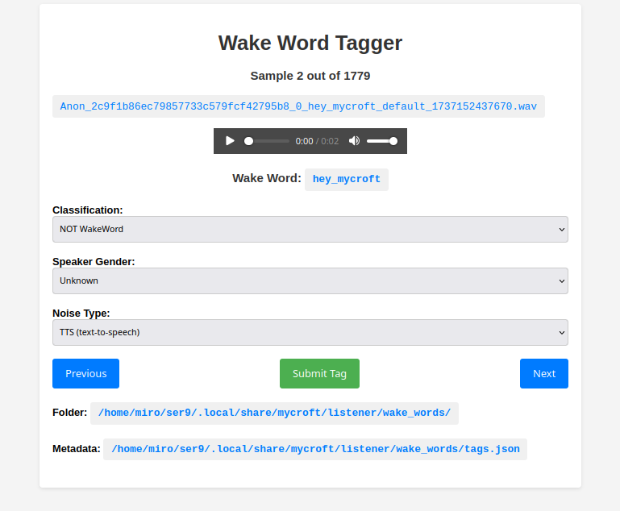

# Wake Word Tagger



The Wake Word Tagger is a web application that allows you to tag and classify audio samples as "Wake Word", "NOT Wake Word", or other categories. 

It also allows you to specify the speaker's gender and the type of silence in the audio sample.

## Features

- Browse and play audio samples (`.wav` files) in a web interface
- Tag each audio sample with a classification (Wake Word, NOT Wake Word, or Unknown)
- Specify the speaker's gender (Male, Female, or Unknown)
- Specify the type of silence in the audio sample (Music/TV, Noise, Human Non-Speech, Silence, or Unknown)
- Navigate through the audio samples using "Previous" and "Next" buttons
- Automatically save the tags and metadata to a JSON database file

## Usage

```bash
git clone https://github.com/your-username/wake-word-tagger

cd wake-word-tagger

pip install -r requirements.txt

python app.py --folder /path/to/audio/files --db /path/to/tags.json
```

Replace `/path/to/audio/files` with the actual path to the folder containing the `.wav` files, and `tags.json` with the JSON database file. 

If not specified will default to `~/.local/share/mycroft/listener/wake_words` (default save path for **ovos-listener**)

Open your web browser and navigate to `http://localhost:5000` to access the Wake Word Tagger interface.

## Contributing

If you find any issues or have suggestions for improvements, feel free to open an issue or submit a pull request.