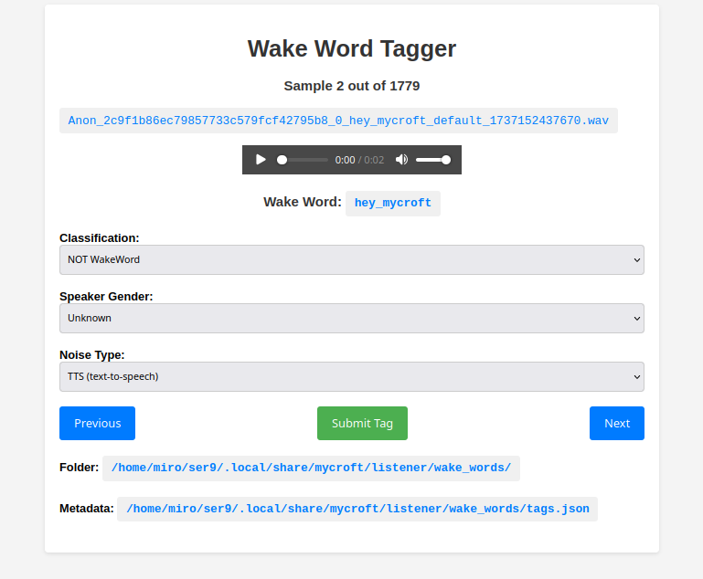

# Wake Word Tagger



Wake Word Tagger is a web application for tagging audio samples. Use it to classify `.wav` files as "Wake Word", "NOT Wake Word", or another category. It also records the speaker's gender and the type of background noise.

## Features

- Browse and play `.wav` audio samples in a web interface.
- Tag each sample as Wake Word, NOT Wake Word, or Unknown.
- Record the speaker's gender: Male, Female, or Unknown.
- Record the noise type: Music/TV, Noise, Human Non-Speech, Silence, or Unknown.

Move between samples with the Previous and Next buttons. Tags and metadata save to a JSON database file.

## Install

```bash
git clone https://github.com/TigreGotico/ww_tagger
cd ww_tagger
pip install -r requirements.txt
```

## Usage

```bash
python app.py --folder /path/to/audio/files --db /path/to/tags.json
```

Replace `/path/to/audio/files` with the folder that holds the `.wav` files. Replace `/path/to/tags.json` with the JSON database file to store tags in.

If you do not set `--folder`, the app uses `~/.local/share/mycroft/listener/wake_words`, the default save path used by [ovos-listener](https://github.com/OpenVoiceOS/ovos-listener).

Open `http://localhost:5000` in a web browser to use the Wake Word Tagger interface.

## Related projects

- [ovos-listener](https://github.com/OpenVoiceOS/ovos-listener): the OVOS speech daemon that records the wake word samples this tool tags.
- [ovos-ww-plugin-wakeforge](https://github.com/OpenVoiceOS/ovos-ww-plugin-wakeforge): an OVOS wake word plugin that trains on tagged sample data.

## Contributing

Open an issue or submit a pull request for bugs or improvements.
